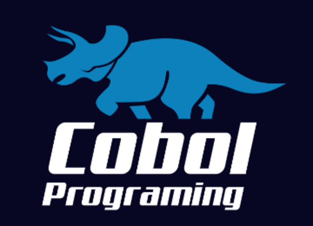

## ¡Bienvenido/a! Explicación:

##### Archivos y proyectos donde practico y aprendo COBOL:

## Lenguajes y tecnologías.

- **En este repositorio encontrará distintos códigos en los cuales aplico cosas aprendidas de *COBOL*, así como su respectiva sintáxis y ejecución.**

-----------------------------------------------
-----------------------------------------------
-----------------------------------------------

## Welcome! Explanation:

##### Files and projects where I practice and learn COBOL:

## Languages and technologies.

- **In this repository you will find different codes in which I apply things learned from *COBOL*, as well as their respective syntax and execution.**

### ¡Muchas gracias por ver mi proyecto! Dejo enlaces para que puedas contactarme:

### Thank you very much for seeing my project! I leave links so you can contact me:

